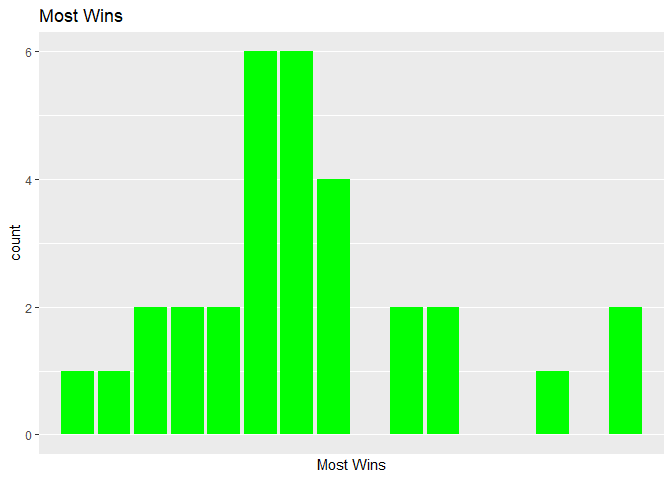
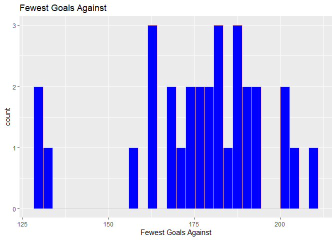
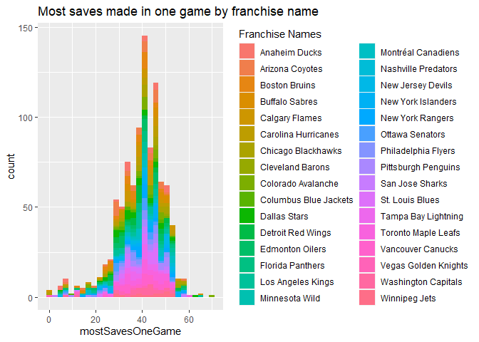
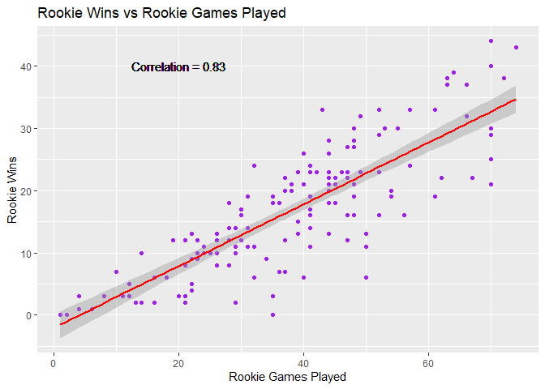
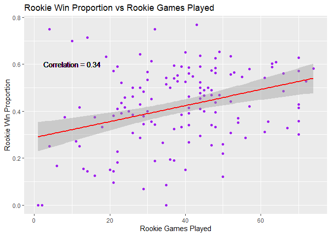
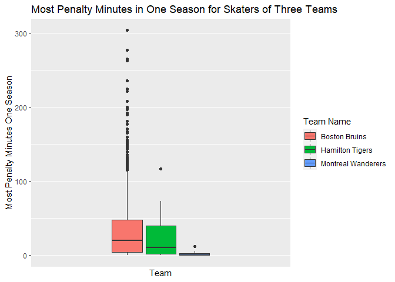

Project 1
================
Laura Mathews
9/12/2020

  - [Required Packages:](#required-packages)
  - [Functions to contact the NHL records
    API](#functions-to-contact-the-nhl-records-api)
  - [Function to contact the NHL stats
    API](#function-to-contact-the-nhl-stats-api)
  - [Create a wrapper function to access either
    API](#create-a-wrapper-function-to-access-either-api)
  - [Exploratory Data Analysis](#exploratory-data-analysis)
      - [Obtain and Manipulate Data:](#obtain-and-manipulate-data)
      - [Table of Fewest Losses by Win
        Streak](#table-of-fewest-losses-by-win-streak)
      - [Table of Most Goals against the Goalie by Division
        Name](#table-of-most-goals-against-the-goalie-by-division-name)
      - [Table of Number of Seasons Played by a Goalie grouped by
        Team](#table-of-number-of-seasons-played-by-a-goalie-grouped-by-team)
  - [Plots](#plots)
      - [Most Wins Bar Plot](#most-wins-bar-plot)
      - [Fewest Goals Against
        Histogram](#fewest-goals-against-histogram)
      - [Most goals saved in one game by franchise
        name](#most-goals-saved-in-one-game-by-franchise-name)
      - [Rookie wins vs rookie games played scatterplot and Rookie win
        proportion vs rookie games played
        scatterplot](#rookie-wins-vs-rookie-games-played-scatterplot-and-rookie-win-proportion-vs-rookie-games-played-scatterplot)
      - [Most penalty minutes in one season
        boxplot](#most-penalty-minutes-in-one-season-boxplot)
  - [Numerical Summaries](#numerical-summaries)

# Required Packages:

  - httr
  - jsonlite
  - tidyverse
  - dplyr
  - knitr: needed for exploratory data analysis
  - rmarkdown

<!-- end list -->

``` r
#Read in required packages
library(httr)
library(jsonlite)
library(tidyverse)
```

    ## -- Attaching packages ------------------------------------------- tidyverse 1.3.0 --

    ## v ggplot2 3.3.2     v purrr   0.3.3
    ## v tibble  3.0.0     v dplyr   0.8.5
    ## v tidyr   1.0.2     v stringr 1.4.0
    ## v readr   1.3.1     v forcats 0.5.0

    ## -- Conflicts ---------------------------------------------- tidyverse_conflicts() --
    ## x dplyr::filter()  masks stats::filter()
    ## x purrr::flatten() masks jsonlite::flatten()
    ## x dplyr::lag()     masks stats::lag()

``` r
library(dplyr)
library(knitr)
library(rmarkdown)
```

# Functions to contact the NHL records API

``` r
#API test

hockey <- GET("https://records.nhl.com/site/api/franchise")
hockey <- fromJSON(content(hockey, "text"), flatten = TRUE)
```

    ## No encoding supplied: defaulting to UTF-8.

``` r
records_API <- function(endpoint, record = NULL, filter = NULL){

  base_url <- "https://records.nhl.com/site/api"

  #Note: When looking at the records API information, I interpreted the url to have a main endpoint, such as "franchise" and then a specific record, such as "team totals", and finally filters. This is reflected in the function variables.
  
  #To be able to filter by franchiseId where either the team name or ID number are given, need to first check if filter is franchiseId and then if the ID is character or number. If franchiseId is character, get the team name and Id data and find the corresponding team number.

  if (is.null(filter) == FALSE){
  
  teamId <- str_split(filter, pattern = "=", n = 2, simplify = TRUE)
  filter_name <- str_trim(teamId[1])
  teamId <- str_trim(teamId[-1])
  
 if (grepl("\\d", teamId) == TRUE){
  filter <- filter
} else if (grepl("\\d", teamId) == FALSE){
    
    teamdata<- GET("https://records.nhl.com/site/api/franchise")
    teamdata<- fromJSON(content(teamdata, "text"), flatten = TRUE)
    teamdata<- teamdata$data
    teamdata<- select(teamdata, mostRecentTeamId, teamPlaceName, teamCommonName) %>% arrange(mostRecentTeamId) %>% rename(id = mostRecentTeamId) %>% unite(teamPlaceName, teamCommonName, col = "name", sep = " ")

    teamId2 <- filter(teamdata, name == teamId) %>% select(id) %>% unlist()
    filter <- paste0(filter_name, "=", teamId2)
}
}
  
  #Create the URL
  
  url<-paste0(base_url, "/", gsub(pattern = " ", replacement = "-", x = endpoint))
  
  #Add record if given
  
  if (is.null(record) == FALSE){
    record<- tolower(gsub(pattern = " ", replacement = "-", x = record))
    url<-paste0(url, "-", record)
  }
  
  #Add filter if given
  
  if (is.null(filter) == FALSE){
    
    #Player filters
    
    if (tolower(endpoint) == "player"){
    filter <- gsub("\\D", "", filter)
    url <- paste0(url, "/byTeam/", filter)
    
      #General filters
    } else if (length(filter) == 1) {
      filter<-gsub(pattern = " ", replacement = "", x = filter)
      url<-paste0(url, "?cayenneExp=", filter)
      
      #If there is more than one filter
      } else if (length(filter) > 1) {
          filter<-gsub(pattern = " ", replacement = "", x = filter) %>% paste(collapse = "%20and%20")
          url<-paste0(url, "?cayenneExp=", filter)
      }
  }
  
  hockey_data <- GET(url) %>% content("text") %>% fromJSON(flatten = TRUE)
  
  hockey_data <- hockey_data$data
    
  return(hockey_data)
}

#Test code so I don't have to keep typing it in: 
#records_API(endpoint = "franchise", record = "season results", filter = "franchiseId = ID")
```

# Function to contact the NHL stats API

``` r
stats_API <- function(endpoint, ID = NULL, modifier = NULL, teamID = NULL, stats = NULL, season = NULL){
  base_url <- "https://statsapi.web.nhl.com/api/v1"
  
    #To be able to filter by franchiseId where either the team name or ID number are given, need to first check if filter is franchiseId and then if the ID is character or number. If franchiseId is character, get the team name and Id data and find the corresponding team number.

  if (is.null(teamID) == FALSE){
    
    #for length teamID, if teamID[i] is character, get team name
    
    for (i in 1:length(teamID)){
      if (grepl("\\d", teamID[i]) == TRUE){
        teamID[i] <- teamID[i]
      } else if (grepl("\\d", teamID[i]) == FALSE){
    
    teamdata<- GET("https://records.nhl.com/site/api/franchise")
    teamdata<- fromJSON(content(teamdata, "text"), flatten = TRUE)
    teamdata<- teamdata$data
    teamdata<- select(teamdata, mostRecentTeamId, teamPlaceName, teamCommonName) %>% arrange(mostRecentTeamId) %>% rename(id = mostRecentTeamId) %>% unite(teamPlaceName, teamCommonName, col = "name", sep = " ")

    teamId2 <- filter(teamdata, name == teamID[i]) %>% select(id) %>% unlist()
    teamID[i] <- teamId2
}
    }
  }
  
 #Create URL
  
  url <- paste0(base_url, "/", endpoint)
  
  if (is.null(ID) == FALSE){
    if (length(ID) == 1){
      url <- paste0(url, "/", ID)
    } else if (length(ID) > 1){
      url <- paste0(url, "?teamId=", paste(ID, collapse = ","))
    }
  }
  
  if (is.null(modifier) == FALSE){
    modifier <- tolower(gsub(pattern = " ", replacement = ".", x = modifier))
    url <- paste0(url, "?expand=", modifier)
  }
  
  if(is.null(teamID) == FALSE){
    teamID <- paste(teamID, collapse = ",")
    url <- paste0(url, "?teamId=", teamID)
  }
  
  if(is.null(stats) == FALSE){
    stats <- paste(stats, collapse = "")
    url <- paste0(url, "?stats=", stats)
  }
  
  if(is.null(season) == FALSE){
    season <- paste0("&season=", season)
    url <- paste0(url, season)
  }
  
  data <- GET(url) %>% content("text") %>% fromJSON(flatten = TRUE)
  
  data <- data[[2]]
  
  return(data)
}
```

# Create a wrapper function to access either API

``` r
hockey_api <- function(API, endpoint, ...){
  if (tolower(API) == "records"){
    data <- records_API(endpoint, ...)
  } else if (tolower(API) == "stats"){
    data <- stats_API(endpoint, ...)
  }
  
  return(data)
}
```

# Exploratory Data Analysis

## Obtain and Manipulate Data:

``` r
record_data <- hockey_api(API = "records", endpoint = "franchise", record = "season Records")
```

    ## No encoding supplied: defaulting to UTF-8.

``` r
stats_data <- hockey_api(API = "stats", endpoint = "teams", modifier = "team stats")

joined_data <- inner_join(record_data, stats_data, by = "franchiseId")

goalie <- hockey_api(API = "records", endpoint = "franchise", record = "goalie records")
```

    ## No encoding supplied: defaulting to UTF-8.

``` r
#Add proportion of rookie games won to rookie games played to goalie data
goalie <- mutate(goalie, rookieWinProp = rookieWins/rookieGamesPlayed)

team_stats1 <- hockey_api(API = "stats", endpoint = "teams", modifier = "team stats", season = "2014 2015")

team_stats2 <- hockey_api(API = "stats", endpoint = "teams", modifier = "team stats", season = "2012 2013")

team_stats1$division.nameShort <- NULL
team_stats1$division.abbreviation <- NULL

team_stats <- rbind(team_stats1, team_stats2)

division <- select(team_stats, id, name, division.id, division.name, conference.id, conference.name, franchise.franchiseId)
division <- rename(division, franchiseId = franchise.franchiseId)

skater1 <- hockey_api(API = "records", endpoint = "franchise", record = "skater records", filter = "franchiseId = 2")
```

    ## No encoding supplied: defaulting to UTF-8.

``` r
skater2 <- hockey_api(API = "records", endpoint = "franchise", record = "skater records", filter = "franchiseId = 4")
```

    ## No encoding supplied: defaulting to UTF-8.

``` r
skater3 <- hockey_api(API = "records", endpoint = "franchise", record = "skater records", filter = "franchiseId = 6")
```

    ## No encoding supplied: defaulting to UTF-8.

``` r
skater <- rbind(skater1, skater2, skater3)

goalie_division <- inner_join(goalie, division, by = "franchiseId")
```

## Table of Fewest Losses by Win Streak

The table compares fewest losses with number of games in win streak.
There is no clear pattern between fewest losses and win streak. The most
common win streak length was 11-15 games and the most common number of
fewest losses was 16-20 losses.

## Table of Most Goals against the Goalie by Division Name

The table shows the most goals made against each goalie categorized by
division name. There is no clear pattern based on division name.
However, the counts for each division of most goals against seems to
drop after 11.

## Table of Number of Seasons Played by a Goalie grouped by Team

The table shows the number of seasons played by a goalie. The data is
grouped by team. The majority of players play less than 8 seasons.

``` r
win_streak_cat <- vector()

win_streak_cat <- ifelse(joined_data$winStreak <= 10, "<= 10 Wins", ifelse(joined_data$winStreak <= 15, "11-15 Wins", "> 15 Wins"))

joined_data$win_streak_cat <- win_streak_cat

loss_cat <- vector()

loss_cat <- ifelse(joined_data$fewestLosses <= 10, "<= 10 Losses", ifelse(joined_data$fewestLosses <= 15, "11-15 Losses", ifelse(joined_data$fewestLosses <= 20, "16-20 Losses", ifelse(joined_data$fewestLosses <= 25, "21-25", ifelse(joined_data$fewestLosses >25, "> 25 Losses", "other")))))

joined_data$loss_cat <- loss_cat

kable(table(joined_data$loss_cat, joined_data$win_streak_cat), caption = "Table of Fewest Losses by Win Streak")
```

|               | \<= 10 Wins | \> 15 Wins | 11-15 Wins |
| :------------ | ----------: | ---------: | ---------: |
| \<= 10 Losses |           0 |          0 |          1 |
| \> 25 Losses  |           0 |          0 |          1 |
| 11-15 Losses  |           1 |          0 |          5 |
| 16-20 Losses  |          10 |          0 |          6 |
| 21-25         |           3 |          2 |          2 |

Table of Fewest Losses by Win Streak

``` r
kable(table(goalie_division$division.name, goalie_division$mostGoalsAgainstOneGame), caption = "Most Goals against the Goalie by Division")
```

|              | 0 | 1 |  2 |  3 |  4 |  5 |  6 |   7 |  8 |  9 | 10 | 11 | 12 | 13 | 14 | 15 |
| :----------- | -: | -: | -: | -: | -: | -: | -: | --: | -: | -: | -: | -: | -: | -: | -: | -: |
| Atlantic     | 3 | 5 | 10 | 13 | 31 | 68 | 95 | 106 | 67 | 37 | 24 | 14 |  1 |  3 |  1 |  1 |
| Central      | 4 | 5 |  6 | 13 | 18 | 43 | 81 |  75 | 49 | 32 | 19 | 10 | 11 |  0 |  0 |  0 |
| Metropolitan | 4 | 1 |  9 | 10 | 17 | 31 | 51 |  50 | 35 | 28 |  8 |  7 |  0 |  1 |  1 |  1 |
| Northeast    | 2 | 3 |  3 |  2 | 16 | 31 | 36 |  44 | 29 | 13 | 10 |  7 |  1 |  2 |  0 |  0 |
| Northwest    | 0 | 2 |  5 |  4 |  9 | 26 | 42 |  32 | 21 | 17 |  2 |  2 |  2 |  1 |  0 |  0 |
| Pacific      | 4 | 7 | 15 | 19 | 37 | 67 | 95 |  72 | 41 | 31 | 17 | 11 |  1 |  1 |  0 |  2 |
| Southeast    | 3 | 1 |  2 |  3 |  6 | 24 | 38 |  37 | 18 |  8 |  4 |  3 |  0 |  0 |  0 |  0 |

Most Goals against the Goalie by Division

``` r
kable(table(goalie_division$franchiseName, goalie_division$seasons), caption = "Number of Seasons Played by Team")
```

|                       |  1 |  2 |  3 |  4 | 5 | 6 | 7 | 8 | 9 | 10 | 11 | 12 | 13 | 14 | 15 | 16 | 17 | 21 |
| :-------------------- | -: | -: | -: | -: | -: | -: | -: | -: | -: | -: | -: | -: | -: | -: | -: | -: | -: | -: |
| Anaheim Ducks         | 30 |  8 |  4 |  0 | 2 | 0 | 4 | 2 | 2 |  0 |  0 |  0 |  0 |  0 |  0 |  0 |  0 |  0 |
| Arizona Coyotes       | 46 | 12 | 16 |  8 | 4 | 2 | 2 | 0 | 0 |  0 |  0 |  0 |  0 |  0 |  0 |  0 |  0 |  0 |
| Boston Bruins         | 50 | 22 |  4 |  4 | 4 | 4 | 2 | 2 | 2 |  0 |  4 |  2 |  2 |  0 |  0 |  0 |  0 |  0 |
| Buffalo Sabres        | 28 | 12 |  6 |  6 | 0 | 4 | 0 | 0 | 4 |  0 |  2 |  0 |  0 |  0 |  0 |  0 |  0 |  0 |
| Calgary Flames        | 26 | 14 | 14 |  4 | 2 | 2 | 0 | 0 | 6 |  0 |  0 |  0 |  2 |  0 |  0 |  0 |  0 |  0 |
| Carolina Hurricanes   | 34 | 16 |  8 |  8 | 2 | 6 | 0 | 0 | 0 |  0 |  0 |  0 |  2 |  0 |  0 |  0 |  0 |  0 |
| Chicago Blackhawks    | 46 | 28 |  2 |  0 | 6 | 6 | 0 | 2 | 0 |  2 |  0 |  0 |  2 |  0 |  2 |  0 |  0 |  0 |
| Colorado Avalanche    | 28 | 14 | 12 |  2 | 6 | 2 | 0 | 4 | 0 |  0 |  0 |  0 |  0 |  0 |  0 |  0 |  0 |  0 |
| Columbus Blue Jackets | 16 |  4 |  4 |  2 | 4 | 0 | 2 | 0 | 0 |  0 |  0 |  0 |  0 |  0 |  0 |  0 |  0 |  0 |
| Dallas Stars          | 34 | 18 |  4 |  2 | 6 | 0 | 2 | 0 | 8 |  0 |  0 |  0 |  0 |  0 |  0 |  0 |  0 |  0 |
| Detroit Red Wings     | 36 | 18 | 16 |  6 | 2 | 6 | 6 | 0 | 0 |  0 |  0 |  0 |  0 |  6 |  0 |  0 |  0 |  0 |
| Edmonton Oilers       | 42 | 20 |  6 |  8 | 2 | 2 | 2 | 0 | 0 |  4 |  0 |  0 |  0 |  0 |  0 |  0 |  0 |  0 |
| Florida Panthers      | 30 | 12 |  6 |  2 | 6 | 0 | 0 | 0 | 0 |  0 |  2 |  0 |  0 |  0 |  0 |  0 |  0 |  0 |
| Los Angeles Kings     | 38 | 22 |  8 |  2 | 4 | 4 | 2 | 2 | 2 |  0 |  0 |  0 |  2 |  0 |  0 |  0 |  0 |  0 |
| Minnesota Wild        | 12 |  2 |  0 |  4 | 2 | 4 | 0 | 0 | 4 |  0 |  0 |  0 |  0 |  0 |  0 |  0 |  0 |  0 |
| Montréal Canadiens    | 26 | 18 |  6 |  4 | 2 | 0 | 4 | 6 | 2 |  0 |  2 |  2 |  2 |  0 |  0 |  0 |  0 |  0 |
| Nashville Predators   |  8 |  2 |  4 |  0 | 2 | 0 | 0 | 2 | 0 |  0 |  0 |  0 |  0 |  2 |  0 |  0 |  0 |  0 |
| New Jersey Devils     | 18 | 16 |  6 |  6 | 2 | 2 | 2 | 0 | 0 |  0 |  0 |  0 |  0 |  0 |  0 |  0 |  0 |  2 |
| New York Islanders    | 30 | 10 |  4 |  8 | 2 | 0 | 0 | 2 | 0 |  0 |  0 |  2 |  0 |  0 |  0 |  0 |  2 |  0 |
| New York Rangers      | 28 | 24 |  4 | 14 | 2 | 0 | 2 | 4 | 0 |  2 |  0 |  0 |  0 |  2 |  2 |  0 |  0 |  0 |
| Ottawa Senators       | 20 | 18 |  4 |  4 | 6 | 0 | 0 | 0 | 0 |  2 |  0 |  0 |  0 |  0 |  0 |  0 |  0 |  0 |
| Philadelphia Flyers   | 20 | 18 | 10 | 10 | 6 | 0 | 0 | 0 | 0 |  2 |  2 |  0 |  0 |  0 |  0 |  0 |  0 |  0 |
| Pittsburgh Penguins   | 36 | 10 | 12 |  2 | 6 | 0 | 2 | 0 | 0 |  2 |  0 |  2 |  2 |  0 |  0 |  0 |  0 |  0 |
| San Jose Sharks       | 14 | 10 |  4 |  2 | 6 | 0 | 0 | 0 | 0 |  2 |  0 |  0 |  0 |  0 |  0 |  0 |  0 |  0 |
| St. Louis Blues       | 22 | 22 | 12 | 14 | 4 | 8 | 2 | 0 | 0 |  0 |  0 |  0 |  0 |  0 |  0 |  0 |  0 |  0 |
| Tampa Bay Lightning   | 28 | 22 |  6 |  4 | 2 | 2 | 2 | 0 | 0 |  0 |  0 |  0 |  0 |  0 |  0 |  0 |  0 |  0 |
| Toronto Maple Leafs   | 34 | 28 | 20 |  8 | 6 | 4 | 0 | 2 | 0 |  0 |  0 |  2 |  0 |  2 |  0 |  0 |  0 |  0 |
| Vancouver Canucks     | 30 | 14 | 14 |  8 | 2 | 2 | 2 | 4 | 0 |  0 |  2 |  0 |  0 |  0 |  0 |  0 |  0 |  0 |
| Washington Capitals   | 16 | 16 |  8 | 12 | 0 | 4 | 0 | 0 | 0 |  2 |  0 |  0 |  0 |  0 |  0 |  2 |  0 |  0 |
| Winnipeg Jets         |  8 | 12 |  4 |  2 | 6 | 0 | 0 | 0 | 0 |  2 |  0 |  0 |  0 |  0 |  0 |  0 |  0 |  0 |

Number of Seasons Played by Team

# Plots

## Most Wins Bar Plot

The most wins bar plot has number of wins on the x axis and a count of
how many teams have that number of “most wins” on the y axis. The bar
plot looks similar to a normal distribution with the mean around 52-53
wins.

## Fewest Goals Against Histogram

The fewest goals against histogram shows the count for each value of the
fewest goals against. This histogram does not appear to have a pattern.
There is not really a clear distribution that the histogram resembles.

## Most goals saved in one game by franchise name

The histogram shows the most saves made by a goalie in one game. The
data is grouped by franchise name. There is no clear relationship
between the team that a goalie is on and the number of goals saved in
one game. The histogram does resemble a normal distribution with the
mean around 40 saves in one game.

## Rookie wins vs rookie games played scatterplot and Rookie win proportion vs rookie games played scatterplot

The scatterplot shows the number of rookie games won vs the number of
rookie games played. There appears to be a linear association between
the number of games won and the number of games played; however, there
is a clear upper limit to the number of games won as you can’t win more
than you played. The correlation between the two variables is 0.83. When
the plot is redone using the proportion of wins to games played, the
correlation is much lower, 0.34.

## Most penalty minutes in one season boxplot

The box plot shows the most penalty minutes in one season for skaters on
three different teams: Boston Bruins, Hamilton Tigers, and Montreal
Wanderers. There does not appear to be a large difference between the
Boston Bruins and Hamilton Tigers. The spread is very small for the
Montreal Wanderers and the mean is lower than the other teams. However,
looking at the data, the Montreal Wanderers only have records on 11
players and only 5 had nonzero values for most penalty minutes in one
season.

``` r
g <- ggplot(joined_data,aes(x = mostWins))

g + geom_bar(fill = "green") + scale_x_discrete(name = "Most Wins") + ggtitle("Most Wins") #aes(fill = as.factor(teamName)))
```

<!-- -->

``` r
g <- ggplot(data = joined_data, aes(x = fewestGoalsAgainst))

g + geom_histogram(color = "pink", fill = "blue")  + scale_x_continuous(name = "Fewest Goals Against") + ggtitle("Fewest Goals Against")
```

    ## `stat_bin()` using `bins = 30`. Pick better value with `binwidth`.

<!-- -->

``` r
g<- ggplot(data = goalie, aes(x = mostSavesOneGame))

g + geom_histogram(aes(fill = as.factor(franchiseName))) + ggtitle("Most saves made in one game by franchise name") + scale_fill_discrete(name = "Franchise Names")
```

    ## `stat_bin()` using `bins = 30`. Pick better value with `binwidth`.

    ## Warning: Removed 85 rows containing non-finite values (stat_bin).

<!-- -->

``` r
g<- ggplot(data = goalie, aes(x = rookieGamesPlayed, y = rookieWins))

goalie_rookie<-select(goalie, rookieGamesPlayed, rookieWins) %>% na.omit
correlation <- cor(x = goalie_rookie$rookieGamesPlayed, y = goalie_rookie$rookieWins)

g + geom_point(color = "purple") + scale_x_continuous(name = "Rookie Games Played") + scale_y_continuous(name = "Rookie Wins") + ggtitle("Rookie Wins vs Rookie Games Played") + geom_smooth(method = lm, col = "red") + geom_text(x = 20, y = 40, label = paste0("Correlation = ", round(correlation,2)))
```

    ## `geom_smooth()` using formula 'y ~ x'

    ## Warning: Removed 907 rows containing non-finite values (stat_smooth).

    ## Warning: Removed 907 rows containing missing values (geom_point).

<!-- -->

``` r
#Win Proportion
g<- ggplot(data = goalie, aes(x = rookieGamesPlayed, y = rookieWinProp))

goalie_rookie<-select(goalie, rookieGamesPlayed, rookieWinProp) %>% na.omit
correlation <- cor(x = goalie_rookie$rookieGamesPlayed, y = goalie_rookie$rookieWinProp)

g + geom_point(color = "purple") + scale_x_continuous(name = "Rookie Games Played") + scale_y_continuous(name = "Rookie Win Proportion") + ggtitle("Rookie Win Proportion vs Rookie Games Played") + geom_smooth(method = lm, col = "red") + geom_text(x = 10, y = .6, label = paste0("Correlation = ", round(correlation,2)))
```

    ## `geom_smooth()` using formula 'y ~ x'

    ## Warning: Removed 907 rows containing non-finite values (stat_smooth).
    
    ## Warning: Removed 907 rows containing missing values (geom_point).

<!-- -->

``` r
g <- ggplot(skater, aes(y = mostPenaltyMinutesOneSeason))

g + geom_boxplot(aes(fill = as.factor(franchiseName))) + ggtitle("Most Penalty Minutes in One Season for Skaters of Three Teams") + scale_x_discrete(name = "Team", labels = c("Boston Bruins", "Hamilton Tigers", "Montreal Wanderers")) + scale_y_continuous(name = "Most Penalty Minutes One Season") + scale_fill_discrete(name = "Team Name")
```

<!-- -->

# Numerical Summaries

``` r
#Goalie Losses summary by division
goalie_division %>% group_by(division.name) %>% summarise(avg = mean(losses), med = median(losses), var = var(losses)) %>% kable(caption = "Goalie Losses Summary by Division")
```

| division.name |      avg |  med |      var |
| :------------ | -------: | ---: | -------: |
| Atlantic      | 35.08142 | 17.0 | 2550.987 |
| Central       | 36.78689 | 18.0 | 2501.576 |
| Metropolitan  | 36.72835 | 17.5 | 3152.902 |
| Northeast     | 35.37688 | 16.0 | 2165.408 |
| Northwest     | 32.90303 | 14.0 | 1982.210 |
| Pacific       | 31.09524 | 12.0 | 1976.683 |
| Southeast     | 31.83673 | 19.0 | 1949.740 |

Goalie Losses Summary by Division

``` r
#Goalie Wins summary by division
goalie_division %>% group_by(division.name) %>% summarise(avg = mean(wins), med = median(wins), var = var(wins)) %>% kable(caption = "Goalie Wins Summary by Division")
```

| division.name |      avg | med |      var |
| :------------ | -------: | --: | -------: |
| Atlantic      | 42.40084 |  15 | 5443.755 |
| Central       | 42.77596 |  18 | 4694.246 |
| Metropolitan  | 40.30315 |  15 | 5993.809 |
| Northeast     | 45.98492 |  15 | 5087.510 |
| Northwest     | 36.03030 |  12 | 3368.347 |
| Pacific       | 33.17381 |  10 | 3205.461 |
| Southeast     | 32.73469 |  15 | 2823.128 |

Goalie Wins Summary by Division

``` r
#Goalie Losses summary by team
goalie_division %>% group_by(franchiseName) %>% summarise(avg = mean(losses), med = median(losses), var = var(losses)) %>% kable(caption = "Goalie Losses Summary by Team")
```

| franchiseName         |      avg |  med |       var |
| :-------------------- | -------: | ---: | --------: |
| Anaheim Ducks         | 29.69231 |  7.5 | 2824.9231 |
| Arizona Coyotes       | 21.71111 |  8.0 |  682.6347 |
| Boston Bruins         | 35.96078 | 14.0 | 2330.2163 |
| Buffalo Sabres        | 33.38710 | 15.0 | 2238.2084 |
| Calgary Flames        | 33.62857 | 13.0 | 2303.4253 |
| Carolina Hurricanes   | 34.71053 | 14.0 | 2446.2884 |
| Chicago Blackhawks    | 39.60417 | 13.5 | 4087.4417 |
| Colorado Avalanche    | 29.38235 | 15.0 | 1395.7024 |
| Columbus Blue Jackets | 35.75000 | 14.5 | 2219.9355 |
| Dallas Stars          | 33.43243 | 13.0 | 2507.0981 |
| Detroit Red Wings     | 37.85417 | 20.5 | 2554.9890 |
| Edmonton Oilers       | 27.83721 | 12.0 | 1690.4908 |
| Florida Panthers      | 29.27586 | 13.0 | 2373.6770 |
| Los Angeles Kings     | 33.41860 | 13.0 | 2266.9756 |
| Minnesota Wild        | 42.07143 | 26.5 | 2206.5873 |
| Montréal Canadiens    | 39.40541 | 16.0 | 3021.7238 |
| Nashville Predators   | 53.80000 | 14.5 | 5251.1158 |
| New Jersey Devils     | 36.00000 | 16.0 | 5800.0755 |
| New York Islanders    | 37.63333 | 25.5 | 2144.3040 |
| New York Rangers      | 46.21429 | 15.0 | 5431.9776 |
| Ottawa Senators       | 29.59259 | 20.0 | 1374.5101 |
| Philadelphia Flyers   | 29.00000 | 15.0 | 1424.0597 |
| Pittsburgh Penguins   | 33.35135 | 14.0 | 2283.5735 |
| San Jose Sharks       | 42.36842 | 34.0 | 2118.6174 |
| St. Louis Blues       | 34.19048 | 24.5 |  928.7344 |
| Tampa Bay Lightning   | 25.33333 | 22.0 |  519.2410 |
| Toronto Maple Leafs   | 36.11321 | 23.0 | 1798.4633 |
| Vancouver Canucks     | 37.61538 | 22.0 | 2432.1359 |
| Washington Capitals   | 39.20000 | 26.5 | 3100.7729 |
| Winnipeg Jets         | 29.41176 | 13.0 |  806.1889 |

Goalie Losses Summary by Team

``` r
#Goalie Wins summary by team
goalie_division %>% group_by(franchiseName) %>% summarise(avg = mean(wins), med = median(wins), var = var(wins)) %>% kable(caption = "Goalie Wins Summary by Team")
```

| franchiseName         |      avg |  med |        var |
| :-------------------- | -------: | ---: | ---------: |
| Anaheim Ducks         | 33.34615 |  9.0 |  3632.7798 |
| Arizona Coyotes       | 21.28889 |  8.0 |   947.7134 |
| Boston Bruins         | 52.33333 | 15.0 |  5745.8482 |
| Buffalo Sabres        | 39.96774 |  9.0 |  4796.8842 |
| Calgary Flames        | 39.31429 | 13.0 |  4674.0157 |
| Carolina Hurricanes   | 32.57895 | 13.5 |  3244.9404 |
| Chicago Blackhawks    | 42.56250 | 16.5 |  6777.8908 |
| Colorado Avalanche    | 33.32353 | 12.0 |  3032.4012 |
| Columbus Blue Jackets | 33.43750 |  7.0 |  3060.2540 |
| Dallas Stars          | 40.70270 | 10.0 |  4241.2529 |
| Detroit Red Wings     | 49.02083 | 19.5 |  5934.7575 |
| Edmonton Oilers       | 30.67442 |  8.0 |  2645.4927 |
| Florida Panthers      | 28.44828 | 16.0 |  2182.4973 |
| Los Angeles Kings     | 33.16279 | 10.0 |  3469.3614 |
| Minnesota Wild        | 50.92857 | 26.0 |  4164.2169 |
| Montréal Canadiens    | 61.54054 | 18.0 |  8750.8271 |
| Nashville Predators   | 68.30000 | 16.5 | 12442.5368 |
| New Jersey Devils     | 39.51852 |  6.0 | 17074.1412 |
| New York Islanders    | 41.03333 | 14.5 |  3982.1345 |
| New York Rangers      | 46.83333 | 16.0 |  7766.9357 |
| Ottawa Senators       | 29.55556 | 11.0 |  2232.4780 |
| Philadelphia Flyers   | 41.20588 | 21.5 |  3256.2256 |
| Pittsburgh Penguins   | 38.83784 | 15.0 |  5097.7816 |
| San Jose Sharks       | 48.05263 | 15.0 |  5648.8080 |
| St. Louis Blues       | 41.11905 | 30.5 |  1727.6242 |
| Tampa Bay Lightning   | 26.60606 | 14.0 |  1326.3347 |
| Toronto Maple Leafs   | 40.90566 | 17.0 |  3266.7529 |
| Vancouver Canucks     | 36.00000 | 19.0 |  3011.7403 |
| Washington Capitals   | 45.36667 | 21.0 |  5226.2701 |
| Winnipeg Jets         | 30.00000 | 14.0 |  1474.0606 |

Goalie Wins Summary by Team

``` r
#Overall Goals Summary
summary(skater$goals)
```

    ##    Min. 1st Qu.  Median    Mean 3rd Qu.    Max. 
    ##    0.00    0.00    4.00   22.36   19.00  545.00

``` r
#Goals Summary by Team
group_by(skater, franchiseName, franchiseId) %>% summarise(avg = mean(goals), med = median(goals), var = var(goals)) %>% kable(caption = "Goals Summary by Team")
```

| franchiseName      | franchiseId |       avg | med |         var |
| :----------------- | ----------: | --------: | --: | ----------: |
| Boston Bruins      |           6 | 22.945055 |   4 | 2763.319310 |
| Hamilton Tigers    |           4 | 14.027778 |   8 |  376.199206 |
| Montreal Wanderers |           2 |  1.545454 |   1 |    4.672727 |

Goals Summary by Team
