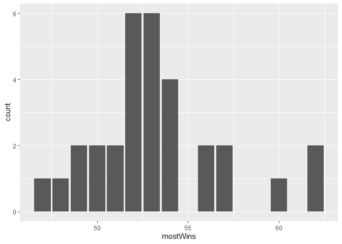
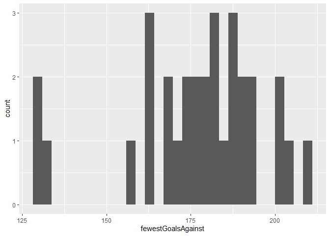

Project 1
================
Laura Mathews
9/12/2020

# Things that need to be fixed

  - all of set up
  - use render(input = “Project 1.Rmd”, output\_file = “README.md”)
  - blog
  - if record/filter/modifier is given then change the url otherwise
    leave it alone
  - No encoding supplied message

# Required Packages:

httr jsonlite tidyverse dplyr

``` r
#Read in required packages
library(httr)
library(jsonlite)
library(tidyverse)
```

    ## -- Attaching packages -----------------

    ## v ggplot2 3.3.2     v purrr   0.3.3
    ## v tibble  3.0.0     v dplyr   0.8.5
    ## v tidyr   1.0.2     v stringr 1.4.0
    ## v readr   1.3.1     v forcats 0.5.0

    ## -- Conflicts --------------------------
    ## x dplyr::filter()  masks stats::filter()
    ## x purrr::flatten() masks jsonlite::flatten()
    ## x dplyr::lag()     masks stats::lag()

``` r
library(dplyr)
library(knitr)
```

# Functions to contact the NHL records API

``` r
#API test

hockey <- GET("https://records.nhl.com/site/api/franchise")
hockey <- fromJSON(content(hockey, "text"), flatten = TRUE)
```

    ## No encoding supplied: defaulting to UTF-8.

``` r
base_url <- "https://records.nhl.com/site/api"

records_API <- function(endpoint, record = NULL, filter = NULL){
  #Create the URL
  
  url<-paste0(base_url, "/", gsub(pattern = " ", replacement = "-", x = endpoint))
  
  if (is.null(record) == FALSE){
    record<- tolower(gsub(pattern = " ", replacement = "-", x = record))
    url<-paste0(url, "-", record)
  }
  
  if (is.null(filter) == FALSE){
    
    #Player filters
    if (tolower(endpoint) == "player"){
    filter <- gsub("\\D", "", filter)
    url <- paste0(url, "/byTeam/", filter)
    } else if (length(filter) == 1) {
      
      #General filters
      filter<-gsub(pattern = " ", replacement = "", x = filter)
      url<-paste0(url, "?cayenneExp=", filter)
    } else if (length(filter) > 1) {
        filter<-gsub(pattern = " ", replacement = "", x = filter) %>% paste(collapse = "%20and%20")
        url<-paste0(url, "?cayenneExp=", filter)
   }
  }
  
  hockey_data <- GET(url) %>% content("text") %>% fromJSON(flatten = TRUE)

  #Note: above returns a list of 2 items, "data" and "total", assuming that only the data is what you would want to return
  
  hockey_data <- hockey_data$data
    
  return(hockey_data)
}

#full_url <- paste0(base_url, "/", tab_name, "/", poke_name)

#pikachu <- GET(full_url) %>% content("text") %>% fromJSON(flatten = TRUE)

#Test code so I don't have to keep typing it in: 
#records_API(endpoint = "franchise", record = "season results", filter = "franchiseId = ID")
```

# Function to contact the NHL stats API

``` r
stats_API <- function(endpoint, ID = NULL, modifier = NULL, teamID = NULL, stats = NULL, season = NULL){
  base_url <- "https://statsapi.web.nhl.com/api/v1"
  
  url <- paste0(base_url, "/", endpoint)
  
  if (is.null(ID) == FALSE){
    if (length(ID) == 1){
      url <- paste0(url, "/", ID)
    } else if (length(ID) > 1){
      url <- paste0(url, "?teamId=", paste(ID, collapse = ","))
    }
  }
  
  if (is.null(modifier) == FALSE){
    modifier <- gsub(pattern = " ", replacement = ".", x = modifier)
    url <- paste0(url, "?expand=", modifier)
  }
  
  if(is.null(teamID) == FALSE){
    teamID <- paste(teamID, collapse = ",")
    url <- paste0(url, "?teamId=", teamID)
  }
  
  #find way to put stats into camel case?
  if(is.null(stats) == FALSE){
    stats <- paste(stats, collapse = "")
    url <- paste0(url, "?stats=", stats)
  }
  
  if(is.null(season) == FALSE){
    season <- paste0("&season=", season)
    url <- paste0(url, season)
  }
  
  data <- GET(url) %>% content("text") %>% fromJSON(flatten = TRUE)
  
  data <- data[[2]]
  
  return(data)
}
```

# Exploratory Data Analysis

``` r
record_data <- records_API(endpoint = "franchise", record = "season Records")
```

    ## No encoding supplied: defaulting to UTF-8.

``` r
#record_data <- record_data$data

stats_data <- stats_API(endpoint = "teams", modifier = "stats")

joined_data <- inner_join(record_data, stats_data, by = "franchiseId")
```

``` r
win_streak_cat <- vector()

win_streak_cat <- ifelse(joined_data$winStreak <= 10, "<= 10", ifelse(joined_data$winStreak <= 15, "11-15", "> 15"))

joined_data$win_streak_cat <- win_streak_cat

loss_cat <- vector()

loss_cat <- ifelse(joined_data$fewestLosses <= 10, "<= 10", ifelse(joined_data$fewestLosses <= 15, "11-15", ifelse(joined_data$fewestLosses <= 20, "16-20", ifelse(joined_data$fewestLosses <= 25, "21-25", ifelse(joined_data$fewestLosses >25, "> 25", "other")))))

joined_data$loss_cat <- loss_cat

kable(table(joined_data$loss_cat, joined_data$win_streak_cat), caption = "Table of Fewest Losses by Win Streak")
```

|        | \<= 10 | \> 15 | 11-15 |
| :----- | -----: | ----: | ----: |
| \<= 10 |      0 |     0 |     1 |
| \> 25  |      0 |     0 |     1 |
| 11-15  |      1 |     0 |     5 |
| 16-20  |     10 |     0 |     6 |
| 21-25  |      3 |     2 |     2 |

Table of Fewest Losses by Win Streak

``` r
g <- ggplot(joined_data,aes(x = mostWins))

g + geom_bar() #aes(fill = as.factor(teamName)) , position = "dodge")
```

<!-- -->

``` r
g <- ggplot(data = joined_data, aes(x = fewestGoalsAgainst))

g + geom_histogram()
```

    ## `stat_bin()` using `bins = 30`. Pick better value with `binwidth`.

<!-- -->
